# Housing Data Flow

This is Housing Data Flow page.

## User Research
“Lorem ipsum dolor sit amet, consectetur adipiscing elit, sed do eiusmod tempor incididunt ut labore et dolore magna aliqua. Ut enim ad minim veniam, quis nostrud exercitation ullamco laboris nisi ut aliquip ex ea commodo consequat. Duis aute irure dolor in reprehenderit in voluptate velit esse cillum dolore eu fugiat nulla pariatur. Excepteur sint occaecat cupidatat non proident, sunt in culpa qui officia deserunt mollit anim id est laborum.”

### Overview
“Lorem ipsum dolor sit amet, consectetur adipiscing elit, sed do eiusmod tempor incididunt ut labore et dolore magna aliqua. Ut enim ad minim veniam, quis nostrud exercitation ullamco laboris nisi ut aliquip ex ea commodo consequat. Duis aute irure dolor in reprehenderit in voluptate velit esse cillum dolore eu fugiat nulla pariatur. Excepteur sint occaecat cupidatat non proident, sunt in culpa qui officia deserunt mollit anim id est laborum.”

### Aimns and Objectives
“Lorem ipsum dolor sit amet, consectetur adipiscing elit, sed do eiusmod tempor incididunt ut labore et dolore magna aliqua. Ut enim ad minim veniam, quis nostrud exercitation ullamco laboris nisi ut aliquip ex ea commodo consequat. Duis aute irure dolor in reprehenderit in voluptate velit esse cillum dolore eu fugiat nulla pariatur. Excepteur sint occaecat cupidatat non proident, sunt in culpa qui officia deserunt mollit anim id est laborum.”

### Expected Impact
“Lorem ipsum dolor sit amet, consectetur adipiscing elit, sed do eiusmod tempor incididunt ut labore et dolore magna aliqua. Ut enim ad minim veniam, quis nostrud exercitation ullamco laboris nisi ut aliquip ex ea commodo consequat. Duis aute irure dolor in reprehenderit in voluptate velit esse cillum dolore eu fugiat nulla pariatur. Excepteur sint occaecat cupidatat non proident, sunt in culpa qui officia deserunt mollit anim id est laborum.”

## Methodology
“Lorem ipsum dolor sit amet, consectetur adipiscing elit, sed do eiusmod tempor incididunt ut labore et dolore magna aliqua. Ut enim ad minim veniam, quis nostrud exercitation ullamco laboris nisi ut aliquip ex ea commodo consequat. Duis aute irure dolor in reprehenderit in voluptate velit esse cillum dolore eu fugiat nulla pariatur. Excepteur sint occaecat cupidatat non proident, sunt in culpa qui officia deserunt mollit anim id est laborum.”

### Focus group discussions - Data Discovery

### Team Interviews

### Output Structure

<ul>
    <li>Process</li>
    More contents.
    <li>Data</li>
    More contents. 
    <li>Definitions</li>
    More contents.
    <li>Cycle</li>
    More contents.
</ul>

### LLM methodology 

## User Research Results 1

### Results overview - BAU process diagram 

### Results overview - BAU data diagram

### LLM result

## User Research Results 2
BAU and Data as Outcome

### Strategic Planning - Local Plan
*Introduction* 
The Strategic Planning team consists of two teams: Place Shaping and Plan Making. The Plan Making team produces a Local Plan every 5 years, which sets out the policies that will shape the borough. The plan comprises the need for new homes, jobs, and services to meet the objectives and will be used to make decisions on planning applications. 

*Process and Outcome Data* 
The process can be divided into 3 stages: Early Engagement, Regulation 18, and Regulation 19. 

  

  <em>Figure 1: Strategic Planning overall workflow</em>

  

  <em>Figure 2: Strategic Planning Early Engagement workflow</em>

**Early Engagement** 
This stage involves gathering data and understanding the demands of stakeholders. It includes conducting consultations and carrying out land studies and site exercises. The outcome of this stage is the reports of studies and GIS layer for Site Allocation. The team receives Call for Site Forms from the public, which includes Site Identification, Land Ownership, Development Opportunities and Constraints, and Delivery Time Frame. 

  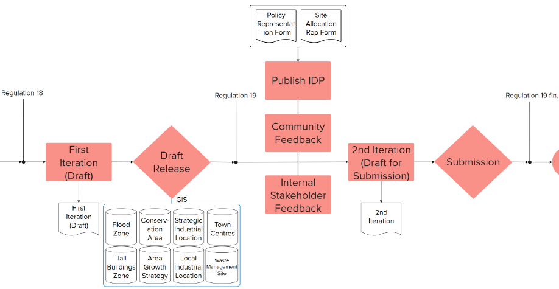

  <em>Figure 3: Strategic Planning Regulation 18 & 19 workflow</em>

**Regulation 18** 
In this phase, the First Iteration of the Local Plan is drafted and released in accordance with the National Planning Policy Framework (NPPF) and the London Plan. The draft includes GIS layered information about Strategic and Local Industrial Locations, Area Growth Strategy, Tall Buildings Zone, Flood Zone, Conservation Area, Waste management Site et cetera. 

**Regulation 19** 
During this phase, the Infrastructure Delivery Plan is published, and the team collects feedback from the council, and the community - through the Policy Representation Form and Site Allocation Representation Form. Following this, a second iteration is prepared incorporating feedback and supported by evidence. The revised plan is then submitted to the Planning Inspectorate concluding the Regulation 19 phase.

  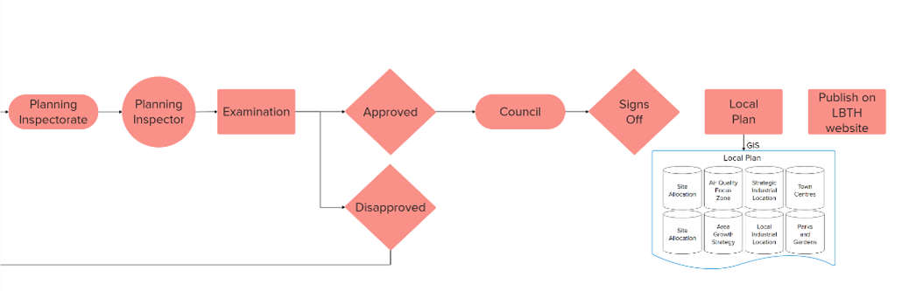

  <em>Figure 4: Strategic Planning Post-Regulation workflow</em>

**Post-Regulation 19** 
After submission, a designated planning inspector reviews the draft. Once approved, the plan advances to the council meeting where it is signed off and published on the LBTH website as well as shared within the council. If disapproved, the plan returns to the Early Engagement and the process starts anew.

  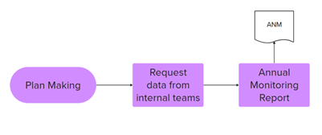

  <em>Figure 5: Strategic Planning AMR workflow</em>

**Annual Monitoring Report** 
The Plan Making team is responsible for preparing the Annual Monitoring Report at the end of the year. They request pertinent data from various internal teams and compile the report based on this information.  

**Consulting** 
Both Place Shaping and Plan Making teams participate in consulting planning application before approval with planning team. The Place Shaping team reviews the design aspect of the application whereas the Plan making team ensures that the application complies with the policies.

### Divisional Support
*Introduction*

*Team Structure*
The team is organised into four main sub-teams:
<ul>
    <li>Planning Support Sub-team(DM Validation)</li>
    <li>Building Control Sub-team(BC Validation and currently allocated the SNN Validation)</li>
    <li>Spatial Data Sub-team</li>
    <li>Record and Information Management Sub-team</li>
</ul>

*Process Overview*

The DS team's workflow includes three main validation processes:
<ol>
    <li>Development Management (DM) Application Validation</li>
    <li>Building Control (BC) Application Validation</li>
    <li>Street Name and Number (SNN) Application Validation</li>
</ol>

(Image)

*Setp 1: Application Submission and Initial Processing*

List and Image to be inserted 

### Development Management

*Introduction* 
The DM team is dedicated to evaluating development cases according to current policies and ensuring that housing construction meets certain conditions and compliance. According to the responsibilities of team members, the DM team can be divided into three groups: Area Planning West Group, Area Planning East Group and Planning Compliance Group. West and East Group handle the case from west and east of Tower Hamlets, while Planning Compliance Group mainly deals with those application that were made without planning permission or in breach of conditions. 
The Development Management (DM) Team takes over a case once the DS Team completes the DM validation process. From this point, the DM Team handles the application, conducts reviews, and makes decisions on whether the development constructure is approved, refused, or approved with conditions.

  

  <em>Figure 6:  The entire workflow of the DM Team</em>

<!-- #region -->
*Process Overview* 
**Step 1: Handover and Initial Checking**
<ol>
    <li>After the DS Team completes the DM validation, the DM Team receives the case, including the application number, supporting documents, and the application form. Depending on the geographical location (East or West), the case is assigned to either the East Team or the West Team. Once the team receives the case, it is assigned to a planner for further review.</li>
    <li>The planner will decide if the case needs to send to a committee to further review and discuss before the initial checking.</li>
    <li>If the scheme is a major development, then the planning will do the validation for this scheme.</li>
    <li>If the planner decides not to send the case to a committee, then the planner will start the work of checking. The checking includes reviewing the application documents, studying any prior decisions related to the site, and initiating any necessary negotiations with the developer.</li>
    <li>Consultations with other teams and departments are also conducted. These consultations may involve the Strategy Planning Team, Housing Team, Community by All Diversity Team, Highway Team, and Environment Team, among others.</li>
</ol>

  

  <em>Figure 7:  Step 1 for DM workflow process</em>

<!-- #endregion -->

**step 2: Decision-Making Process**

**Additional step: Appeal and Committee Review**

**Step 3: Documentation and Notification**

### Infrastructure Planning 
The infrastructure team consists of 3 teams: CIL, S106 and Development Coordination.

#### CIL Team
*Community Infrastructure Levy (CIL) Introduction* 
CIL is a charge levied by the local council on new developments that meet the criteria for liability. The funds collected are used for the community infrastructure projects such as education infra, health, leisure and sports facilities, transportation, open space, employment and enterprise, community centres and youth facilities and other utilities (water, gas, electricity). The team is responsible for both execution and projections, while the CIL team manages the payments and funds.

*CIL Process and Outcome Data*

  

  <em>Figure n: CIL overall workflow</em>

  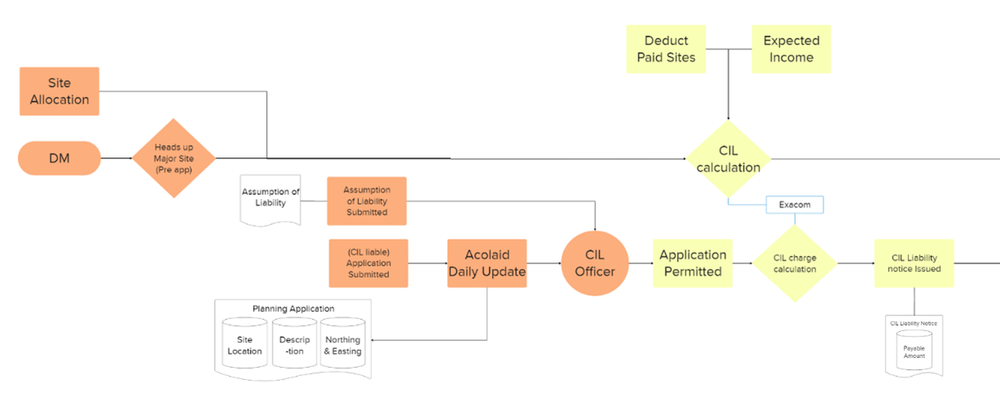

  <em>Figure n: CIL Pre-commencement workflow</em>

**Pre-commencement** 
Once a CIL liable application is submitted, Acolaid sends updates to notify CIL officers. Developers can submit an Assumption of Liability along with the application, acknowledging their CIL liability. After the application is approved, the CIL officer calculates the payable amount based on factors such as land use type, CIL zone, Floor space, demolished floor space and affordable floor space. This payable amount is then informed to the developer in the form of a CIL Liability Notice. 

  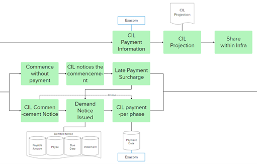

  <em>Figure n: CIL Commencement workflow</em>

**Commencement** 
The developer submits a CIL Commencement Notice indicating the start date of any material operations. This can also be done through direct communication with the CIL officers. After this notice is received, they have 60 days to pay the CIL amount. If the developer submits the commencement notice on time, they qualify for instalment payments. Upon receiving the commencement notice, the CIL officer will issue a Demand Notice that outlines the exact payee, payable amount, due date and if applicable, instalment details. 
Once the payment is made within the 60 days window, the payment information will be updated in Exacom. For phased developments, payment should be made for each phase. However, if the developer proceeds without making payment, and the CIL officer is made aware of this, the CIL officer will issue a new Demand Notice that includes a late payment surcharge.

  

  <em>Figure n: CIL Completion workflow</em>

**Completion** 
The completion of the site is shared with the CIL officer through weekly updates from Acolaid. CIL officers or consultants monitor the development for various reasons. The officers check for any breaches of S106 Agreement for the specified duration. As developers receive Social Housing Relief, the officers are responsible for ensuring that the residence remains in social housing for 7 years. If developers sell the social housing on the market before the period ends, they become disqualified from the relief, which should then be withdrawn. Otherwise, the relief remains in place. If the scheme is not implemented or expires, the CIL charge has to be removed, as well as any relief granted.

 

*CIL Forecasting Process and Outcome Data*

  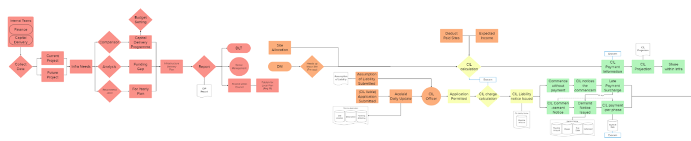

  <em>Figure n: CIL Forecasting overall workflow</em>

The CIL forecasting team’s responsibilities can be divided into two main tasks: the Infrastructure Delivery Plan (IDP) and CIL projection.  

  

  <em>Figure n: CIL IDP workflow</em>

**Infrastructure Delivery Plan (IDP)** 
The CIL forecasting team identifies infrastructure needs and outlines what is required, where it is needed and when, which then will be planned and updated on its delivery. To achieve this, the CIL team gathers information from the Finance and Capital delivery teams to assess infrastructural needs for both existing and upcoming projects. The forecasting team compares this information from Capital Delivery’s Programme and analyses any funding gaps. They then develop placement plans, expected delivery timelines, and recommendations for the year. It will be published for the Local Plan (Reg 19) and reported to DLT and senior management.

**CIL Projection** 
CIL projection is intended for internal use, primarily for budgeting purposes. To calculate the expected income, the team collects data from site allocations and receives heads up from the DM team regarding Major sites at the pre-application stage. Based on these estimates and CIL payment information from Exacom, the team produces CIL projection, which is then shared within the infrastructure team.

#### S106 
*S106 Introduction* 
S106 Agreement is a planning obligation set through negotiations between the developer/landowner and the local authority before permission is granted. This agreement ensures that the developer contributes to the community by improving transport, enhancing biodiversity, providing community facilities, creating open spaces and/or offering affordable housing.

*Process and Outcome Data*

  

  <em>Figure n: S106 overall workflow</em>

  

  <em>Figure n: S106 Pre-commencement workflow</em>

**Pre-commencement** 
When a planning application is made, an initial draft known as the ‘head of terms’ is created. This draft is reviewed early in the application process by S106 officers and with DM officers. This will be developed and refined further as the process continues. The S106 team outlines the terms and conditions of the agreement, working closely with the Legal team while communicating with developers and consults with the internal teams within the council. 

While drafting the agreement, a signed copy of the Rent and Nomination Agreement is provided by the Legal team, which then forms a part of the S106 as it pertains to affordable housing. Once the agreement is finalised, it is signed by both parties, and approval for the corresponding planning application is granted simultaneously. The Agreement includes details such as the tenure, accommodation schedule, wheelchair access, and car-free information. It is then uploaded to Idox and Exacom, as well as any Deed of Variation, if applicable, and the S106 status is updated on Acolaid.

  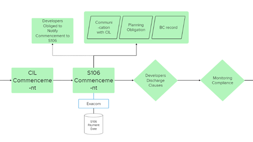

  <em>Figure n: S106 Commencement workflow</em>

**Commencement** 
Developers are required to inform the council about the S106’s commencement, as specified in the terms and conditions of the agreement. There may be instances where this notification is missing. In such cases, S106 officers investigate the commencement by communicating with the CIL team, reviewing any discharged pre-commencement obligations of the application, and checking BC records. Once the project commences, the payment information is updated on Exacom, and the developer discharges relevant the clauses as the construction progresses. Throughout the construction process, compliance with the agreement is monitored and recorded on Exacom.

  

  <em>Figure n: S106 Completion workflow</em>

**Completion** 
Once the construction is completed, the site is handed over from the Housing Supply team to the Registered Provider. The S106 officer will conduct checks to ensure the perpetuity of the social housing, Biodiversity Net Gain (BNG), and Travel (Transportation) over the specified period for each purpose.  If the final certificate for the site has not been issued upon completion, the S106 officer will consult with the Council Tax team or SNN team to verify the development status and will follow the usual completion procedures.

#### Development Coordination
*Introduction* 
Development Coordination has been introduced to expedite the development process by proactively engaging with developers from the approval stage. The aim of the team is to minimise the impact on residents and enhance coordination between construction sites, entailing noise, dust, poor air quality, HGV congestion, and road access issues. The team works closely with internal council teams and maintains regular communication with developers.

*Process and Outcome Data*

  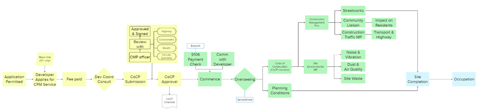

  <em>Figure n: Development Coordination overall workflow</em>

  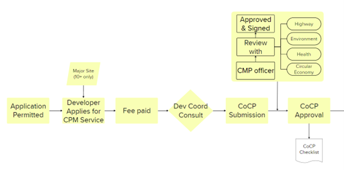

  <em>Figure n: Development Coordination Pre-commencement workflow</em>

**Pre-commencement** 
The Construction Management Plan (CMP) service oversees the compliance of CMP and Site Environmental Management Plans (SEMP) throughout the entire construction process. The team’s engagement begins when a developer applies for CMP services following the approval of a major application. Once the fee is paid, the CMP officer assists the developer in completing the Code of Construction Practice Checklist, which is mandatory for all major development schemes. During the review stage, the Development Coordinator consults with various internal teams including Highway, Environment, Health and Circular Economy. After the checklist is approved and signed, the developer can commence work.

  

  <em>Figure n: Development Coordination Post-commencement workflow</em>

**Post-Commencement** 
The CMP officer will recognise the commencement through communications with developers or S106 payment. From this point onward, the CMP Service will monitor compliance with relevant documents for the duration of the development. This checklist details the necessary information for the discharging plans, including the CMP and Construction Traffic Management Plan, as well as the SEMP. The SEMP is comprised of three parts: Part A covers Noise & Vibration Management Plan, Part B addresses Dust and Air Quality Management Plan, and Part C focuses on the Site Waste Management Plan. Compliance with the CoCP is monitored using a spreadsheet throughout the construction, and the development coordination’s responsibilities conclude when the occupation begins. 

### Building Control
*Introduction* 
Building Control is a process that ensures construction works comply with building regulations and standards for the health and safety of residents before any works begin. The team oversees various types of building works specified in the regulations, such as new buildings, change of use, and alteration or conversion of existing buildings. The application will be reviewed and monitored throughout the development and can be issued a certificate upon completion. Besides Building Control, two other entities can serve similar functions: Approved Inspector and Building Safety Regulator (BSR). 

*Process and Outcome Data*

  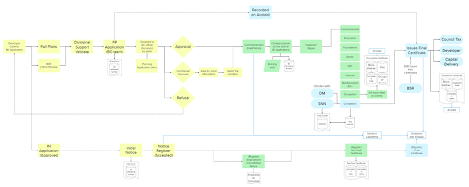

  <em>Figure n: Building Control overall workflow</em>

  

  <em>Figure n: Building Control Pre-commencement workflow</em>

**Building Control Pre-commencement** 
When Developers submit Building Control applications through the Building Control Portal, Divisional Support processes appropriate documentation. After Divisional Support validates the application, the BC team hands it over to an assigned to an officer (surveyor) who evaluates it to determine whether it will be approved, approved with conditions, or refused.  

Once the application is approved, the developer should notify the BC team by submitting commencement notice at least 48 hours prior to starting work. When the application is granted with conditions, the developers will be asked to provide more information. Once the BC officer sufficiently gathered the relevant information, the developer can begin the construction process. If the application is refused, the developer will need to start the approval process from the beginning to commence the construction.

  

  <em>Figure n: Building Control Post-commencement workflow</em>

**Building Control Post-commencement** 
As the building work begins, the BC officer starts the first stage of Inspection, which will be recorded on Acolaid along with the inspection date. A total of nine inspection will be conducted by BC officers and recorded as the construction proceeds. Advancing towards the completion, if the site is partially finished and ready for occupancy, the officers can perform the occupation inspection and issue the Occupation Certificate for the pertinent plots. The Occupation Certificate includes details such as the completed block address, plot number, date, as well as the name of the owner (occupier). Divisional Support enters again during this stage to send occupation letters to clients.  

Once the entire site is completed, the BC officer will review the planning applications to ensure they align with the result. They will also cross-reference the BC plot information with the SNN Final Order addresses. Similar to the Occupation Certificate, the Final Certificate contains information about the block address, completion date, and inspection date. All documents generated during this process, including the Final Certificate, will be saved in Laserfiche and uploaded into Acolaid. The Final Certificate will then be shared with various council teams including Council Tax and Capital Delivery, as well as the developers.  

  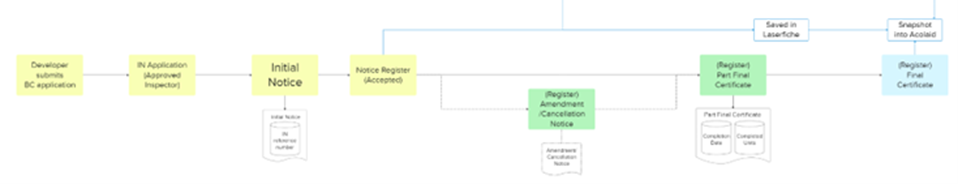

  <em>Figure n: Building Control Approved Inspector workflow</em>

**Approved Inspector** 
Approved Inspectors are private entities approved by government and BSR to provide building control services. Their roles and functions are similar to those of Local Authority Building Control and Developers have the option to have their inspections conducted by Approved Inspectors.  

When the developers chose this option, the Approved Inspector submits Initial Notice (IN) Application to BC, and later notifies the council about the commencement of the work. The registration of this Notice by BC is considered acceptance of the work and will be assigned a reference number. If any Amendments or Cancellations occur, the Approved Inspector will send a notice to the council. On a par with the Occupation Certificate by BC, a Part Final Certificate is provided for partially completed work, detailing the completion date and unit details, followed by the Final Certificate upon full completion. All the notices and certificates that are shared with the council is saved in Laserfiche and registered on Acolaid.   

**Building Safety Regulator (BSR)** 
Starting in 2023, high-risk buildings – over 7 stories or 18 metres tall -need to obtain Building Control approval from BSR. During this process, the BC team acts as a consultant. Once BSR receives the application, they check with the local council to ensure they have the capacity to process the application. After construction begins, the BC team provides technical advice and ensures compliance with development regulations. The BSR will manage the overall process will issue all the correspondences and certificates related to the project.

### Street Naming and Numbering
*Introduction* 
The Street Name and Number (SNN) Team manages the official naming and numbering of streets and buildings in new sites. Their work begins after the SNN validation from DS Team, ensures that the building names and addresses are unique and compliant.

  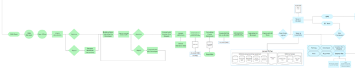

  <em>Figure n: Street Naming and Numbering overall workflow</em>

*Process Overview* 
**Step 1: Intial Check and Handover**
<ul>
    <li>Once the DS Team completes the SNN validation process, the application is handed over to the SNN Team. The SNN Manager assigns it to a Case Officer.</li>
    <li>The Case Officer starts an initial check to ensure all necessary documents are there. If documents are incomplete, the Case Officer rejects the case and requests additional information from the developer.</li>
</ul>

  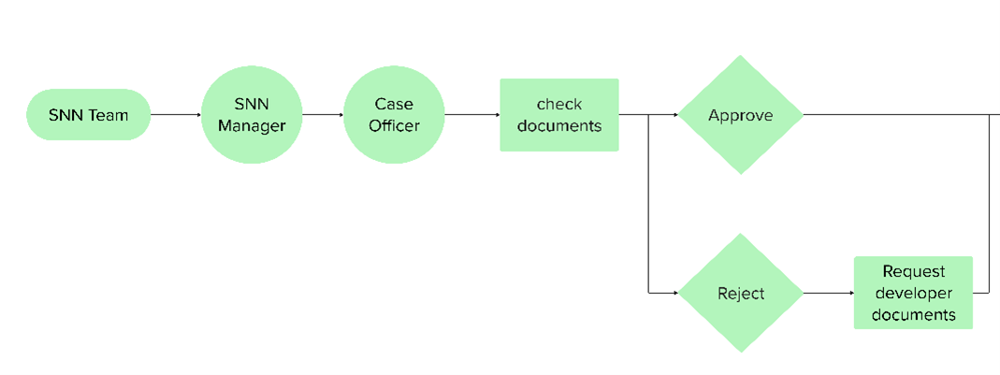

  <em>Figure n: Step 1 for SNN process</em>

**Step 2: Name Selection and Confirmation** 
<ul>
    <li>After the initial checks, the Case Officer consults with the developer to select building and street names.</li>
    <li>The developer may either provide names or ask for suggestions from the SNN Team.</li>
    <li>Once names are proposed, the Case Officer checks their uniqueness using the Local Land and Property Gazetteer (LLPG). If the name is a duplicate, the developer is asked to provide new names.</li>
    <li>Once a name is selected, the Case Officer consults the London Fire Brigade and assigns addresses based on British Standards 7666.</li>
    <li>The Case Officer creates a street and building plan in Acolaid DMS and ArcMap.</li>
    <li>The Case Officer works with Royal Mail to confirm the postal codes. Royal Mail provides the postcodes, finalising the complete addresses.</li>
</ul>

  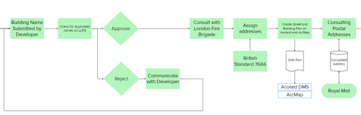

  <em>Figure n: Step 2 for SNN process</em>

**Step 3: Sign, Store, and Share the Documents** 
<ul>
    <li>The Case Officer create the BLUPs link on Acolaid DMS as a unique Identifier. </li>
    <li>The Case Officer then creates the necessary documents:</li>
        <ul>
            <li>SNN Development Spreadsheet – records for site Plot Detail, Official/Postal Address Details, Residential Details, Application Case Reference Number and Car Parking Restrictions</li>
            <li>Final Order – Formal document recording the street names and addresses.</li>
            <li>Address Schedule – A detailed list of all assigned addresses.</li>
            <li>Cover Letter – Accompanying formal communication for the documents.</li>
        </ul>
    <li>These documents are submitted to the SNN Manager for review.</li>
    The documents are also shared with the Building Control (BC) Team for cross-checking, confirming that the site has been completed.</li>
    <li>Upon approval, the Final Order and relevant documents are stored in the appropriate systems. The SNN Development Spreadsheet, Cover Letter, and SNN Schedule are stored in Laserfiche. The Final Order is saved in Acolaid DMS.</li>
    <li>The Final Order is shared with key stakeholders, including the Parking Team, Council Tax Team, Land and Property Gazetteer (LPG) Team and the BC Team, while external entities like NHS, Royal Mail, the developer, and the London Fire Brigade are notified via email or copies of the documents.</li>
</ul>

  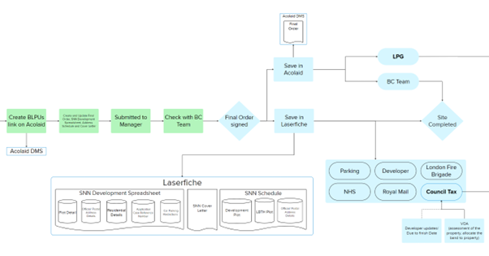

  <em>Figure n: Step 3 for SNN process</em>

### Land and Property Gazetteer – LPG 
*Introduction* 
The Local Land and Property Gazetteer (LLPG), interchangeably called LPG, is an address database maintained by the local authority for properties and land within the borough. The team is responsible for managing the addresses using Unique Property Reference Number (UPRN) as a key identifier.

  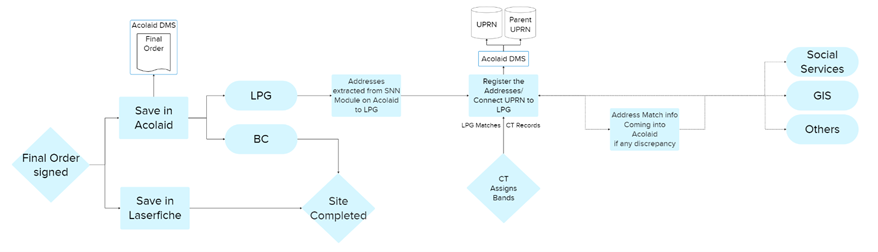

  <em>Figure n: Land and Property Gazetteer overall workflow</em>

*Process and Outcome Data* 
Once a development is completed and the SNN team signs off the Final Order, the information is saved in Acolaid, including details about the units and addresses. This addresses from the SNN module are then extracted to LPG module, where the LPG officer registers the addresses and connects them to the Parent/UPRN. This information is also updated in Acolaid and the final address is shared with GIS, Social Services, and with other teams within the council. 

The LPG team conducts a monthly address check with Council Tax. They receive addresses from CT, match them, assign a UPRN, and then load the updated information back into CT system. Additionally, the LPG team checks for discrepancies between GeoPlace, which is updated with input from local authorities. If any discrepancies arise between GeoPlace and LPG, the team is notified and will correct the addresses accordingly.

### Housing Supply
*Introduction* 
The Housing Supply Team plays a key role in the early-stage development of housing sites and the subsequent phases of site approval, commencement, and completion. Their work is divided into two main parts: involvement in the Local Plan process and post-approval activities related to rent and nominations.

*Process Overview* 
**Part 1: Involvement in the Local Plan**
<ul>
    <li>During the Local Plan stage, the Housing Supply Team works on a check of potential sites that could be developed for housing. This check focuses on physical condition of the site, construction feasibility, ownership status and risk associations.</li>
    <li>If a site is deemed unsuitable for development, it is rejected with a classification of “cannot be developed.” If the site is suitable, it is accepted and added to the Planning Portal, where developers can apply for permission to develop the site.</li>
    <li>After identifying developable sites, the Housing Supply Team hands over their findings to the Capital Delivery Team.</li>
</ul>

  

  <em>Figure n: Part 1 for HS process</em>

**Part 2: Site Approval, Commencement, and Completion** 
<ul>
    <li>The Housing Supply Team participates to Rent and Nominations preparations and signs with the Section 106 Team (S106), Legal Team, and Registered Providers through meetings and emails after a site be approved, to ensure the agreements are legally binding and properly prepared.</li>
    <li>At the commencement stage, the Housing Supply Team checks affordable housing details, including scheme names, tenants, bedroom sizes, which is crucial for tracking the housing supply.</li>
    <li>The Housing Supply Team check the data with Registered Providers and DDC&IU Team to ensure its accuracy.</li>
</ul>

  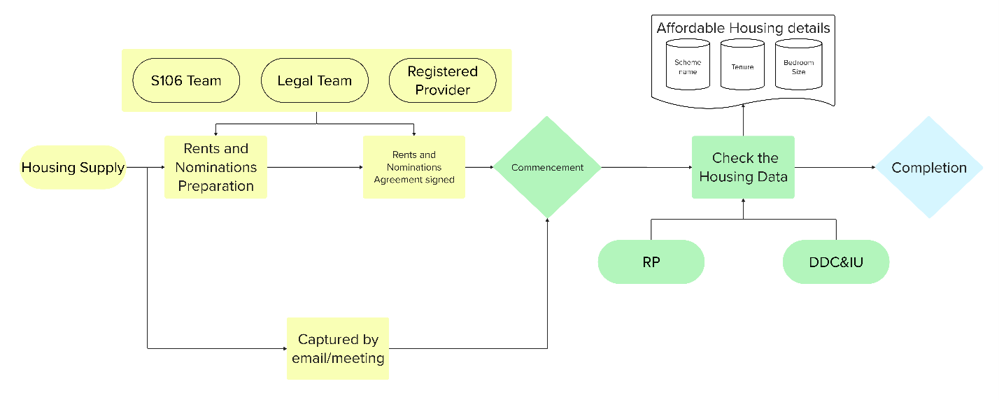

  <em>Figure n: Part 2 for HS process</em>

### Council Tax

### Capital Delivery

### Waste and Environment
